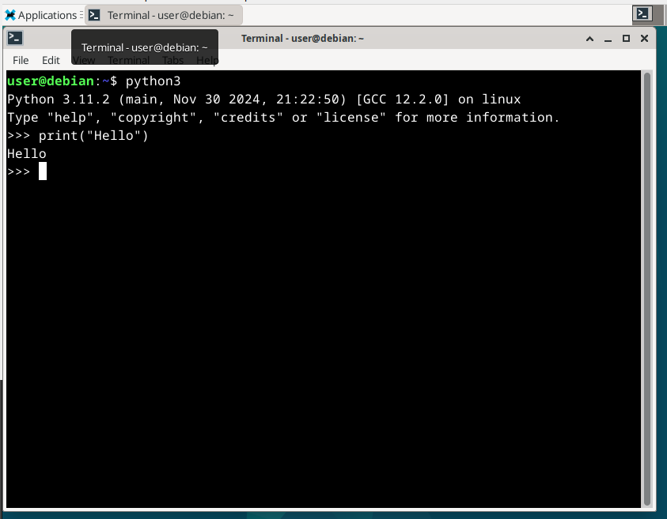

# H1 ensimmäiset läksyt

Tehtävänannot kaikki löytyneet [Tero Karvisen Linux Palvelimet -kurssin kotisivulta](https://terokarvinen.com/linux-palvelimet/)

## Raportin kirjoittaminen[^1]

- Raportin tulisi olla kirjoitettu siten, että käyttäjän tekemät tapahtumat olisi toistettavia.
- Sisällytä komennot, ajankohdat, odottamattomat tulokset/ongelmat
- Kirjoita menneessä aikamuodossa
- Käytä väliotsikoita

## Free Software Foundation

### Neljä vapautta[^2]

- Vapaus käyttää ohjelmistoa haluamallaan tavalla.
- Vapaus tutkia ohjelmiston toimintoo ja muuttaa sitä omien tarpeidensa mukaan. Avoin lähdekoodi vaatimuksena.
- Vapaus jakaa ohjelmiston kopioita muiden kanssa.
- Vapaus levittää omia muokattuja versioitaan.

## Linuxin asentaminen virtuaalikoneelle

### Tapahtumat

- Ladattu debian 12.9 ison [täältä](https://mirror.as35701.net/debian-cd/12.9.0-live/amd64/iso-hybrid/debian-live-12.9.0-amd64-xfce.iso)
- sudo apt-get install virtualbox
- Avattu virtualbox, setupattu virtuaalikoneen painamalla New.
  - Kaikki perusasetukset mitä virtualbox tarjoaa
- Bootattu virtuaalikone ja asennettavaksi ladattu iso
  - Ensimmäinen ongelma: "This kernel requires an x86-64 CPU, but only detected i686 CPU..."
  - Selkeästi siis jäänyt virtualboxin asetuksista jostain päälle jokin 32-bittinen asetus.. eli suljetaan VM ja lähdetty asetuksiin.
    - Korjattu seuraavasti: Virtualbox -> Settings -> General -> Basic -> Version: Debian (64-bit)
- Reboot, mountattu iso. Kaikki lähti käyntiin. Debian Live versiossa pääsi kirjoittelemaan, hiirellä klikkailemaan, vierailemaan nettisivuilla.
- OK

### Suosikkiohjelmani Linuxilla

- Avattu terminaali, avattu python3.
  - koitettu kirjoittaa `print("Hello")`
    - Huomattu, että englanninkielinen näppis, eikun vaihtamaan suomenkieliseksi, koska ()()() ei tule oikein
      - Settings -> Keyboard -> Language settings ja sieltä löytyy Finnish
  - Uusiksi terminal -> python3 -> `print("Hello")`
    tuottaa halutun lopputuloksen
    

[^1]: Raportin kirjoittaminen, Tero Karvinen, 2006, https://terokarvinen.com/2006/raportin-kirjoittaminen-4/
[^2]: What is Free Software?, GNU, https://www.gnu.org/philosophy/free-sw.html
