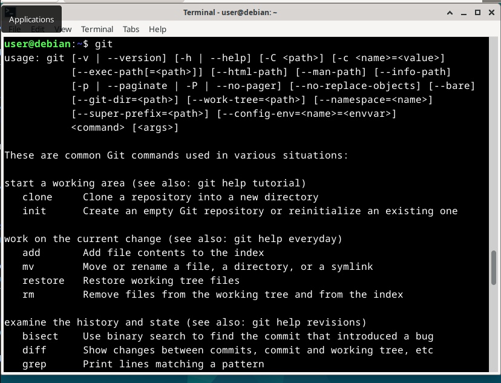
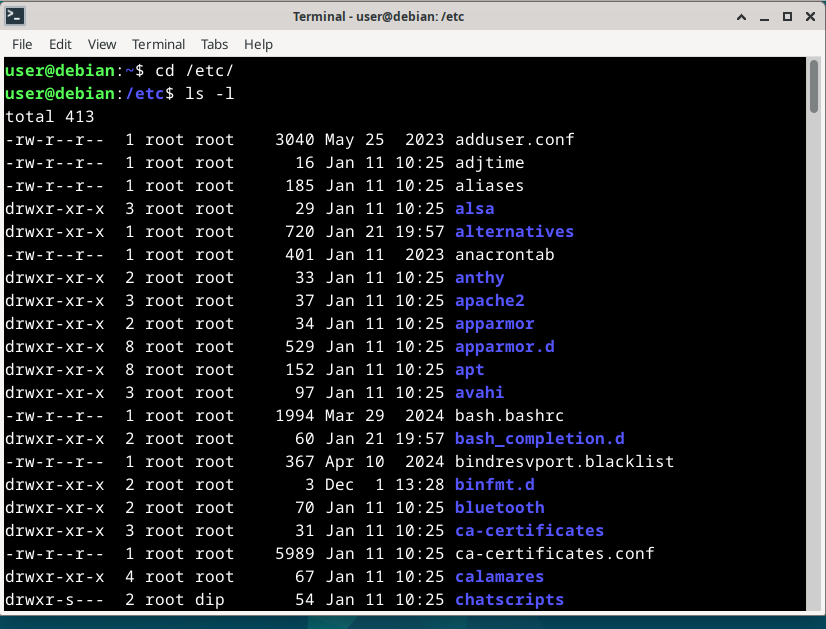

# H2 kotiläksyt

Tehtävänannot kaikki löytyneet [Tero Karvisen Linux Palvelimet -kurssin kotisivulta](https://terokarvinen.com/linux-palvelimet/)

### Tiivistelmä

Command line basics revisited -sivulla[^1] kerrotaan paljon hyödyllisiä komentoja niin Linux-ympäristön aloittelijalle, kuin harrastelijallekin. Alussa kirjoiteltiin ihan perusasioita, joilla pääsee alkuun Linuxin komentorivillä, kuten **pwd**, **ls** ja **cd**. Itselleni tuttua oli jo nämä edeltävät, sekä **pipe** ja **grep** -komennot, mutta uutena tuli **less** ja **nl** -vaihtoehdot.

Myöskin tosi hyödyllinen komento oli **history**, sillä olen monesti koittanut muistaa jotakin komentoa viikkojen takaa, ja käynyt sitä etsimässä kaikin muin keinoin. Tämähän helpottaa huomattavasti!

### Asioiden asentelu

- **a)** Ennen kuin aletaan asentelemaan mitään, niin ajetaan päivitystietokannan päivityskomento `sudo apt update`, jonka jälkeen `sudo apt install micro`. 
- **b)** Itselleni mieluisimmat ensimmäiset asennukset aptilla ovat aina uudessa ympäristössä **git**, **vim**, ja luultavasti **trash-cli**, koska **rm** on liian voimakas komento omaan mieleeni. Kaikki kolme voidaan asentaa samaan aikaan komennolla sudo apt install git vim trash-cli
     
- **c)** Komennot näkyvät kuvissa
     
- **d-e)** Ensimmäisessä kuvassa etsitään kaikki rivit jossa lukee **ipsum** .txt tiedostosta joka sisältää kuuluisan Lorem ipsum -tekstiä, ja värjätään se punaiseksi.
  
  Seuraavassa kuvassa taas etsitään kotihakemistosta **find**-komennolla löytyykö kotihakemistosta tai sen alakansioista mitään, joka sisältäisi sanan **lorem**. Samalla tulee näytettyä **pipe**-komennon käyttö.
  
- **f)** Ensiksi pitikin asentaa **lshw**
  
  Komento **lshw** näyttää listaavan kaiken raudan, jota kone tunnistaa
  

### Ympäristötiedot

#### CPU Information:

- Architecture: x86_64
- Model: 12th Gen Intel(R) Core(TM) i5-12600K
- Cores/Threads: 10 cores, 16 threads
- Virtualization: VT-x enabled
- Max Frequency: 4.9 GHz

#### Memory Info:

- Total: 31GB
- Used: 4.2GB
- Available: 26GB
- Swap: 8GB

#### Disk Info:

- Samsung 980 PRO SSD 1TB M.2 - SSD

#### Operating System Info:

- Ubuntu 24.04.1 LTS (Codename: noble)
- Kernel: 6.8.0-51-generic

#### VirtualBox Version:

- 7.0.16_Ubuntur162802

#### GPU Information:

```
+-----------------------------------------------------------------------------------------+
| NVIDIA-SMI 550.120                Driver Version: 550.120        CUDA Version: 12.4     |
|-----------------------------------------+------------------------+----------------------+
| GPU  Name                 Persistence-M | Bus-Id          Disp.A | Volatile Uncorr. ECC |
| Fan  Temp   Perf          Pwr:Usage/Cap |           Memory-Usage | GPU-Util  Compute M. |
|                                         |                        |               MIG M. |
|=========================================+========================+======================|
|   0  NVIDIA GeForce RTX 3080        Off |   00000000:01:00.0  On |                  N/A |
|  0%   37C    P5             34W /  340W |     623MiB /  10240MiB |      2%      Default |
|                                         |                        |                  N/A |
+-----------------------------------------+------------------------+----------------------+
```

[^1]: Command Line Basics Revisited, Tero Karvinen, https://terokarvinen.com/2020/command-line-basics-revisited/?fromSearch=command%20line%20basics%20revisited
