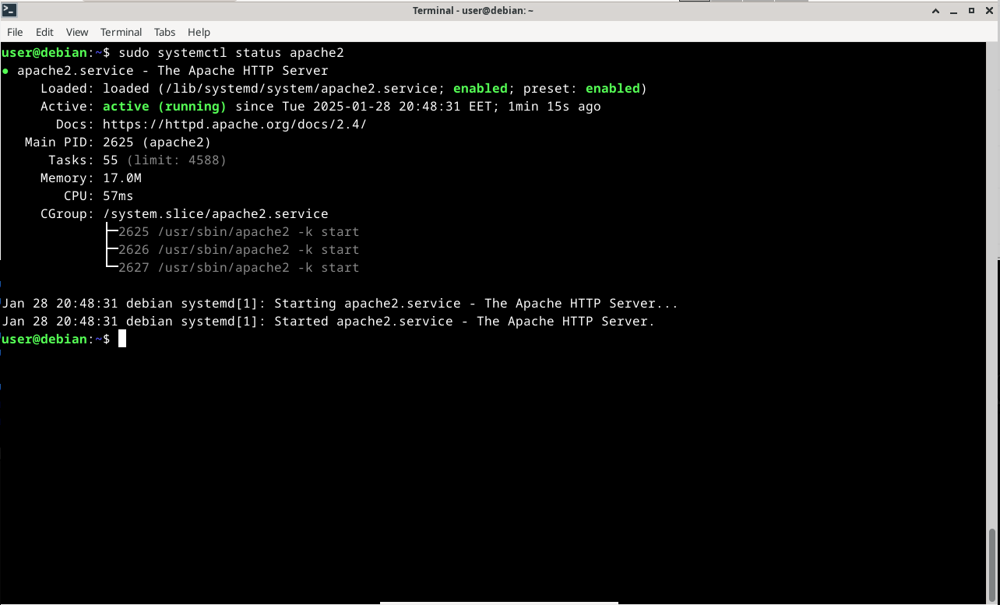
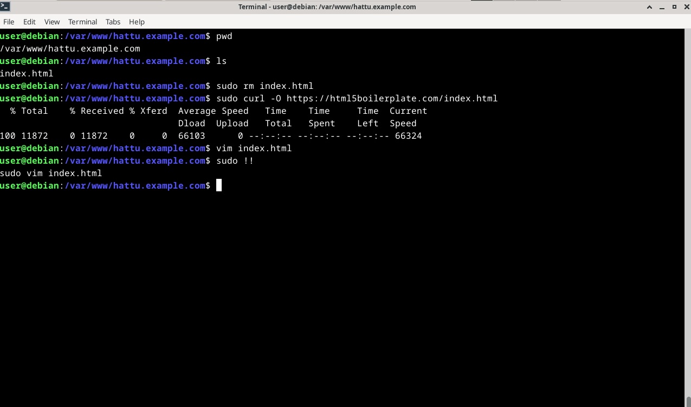
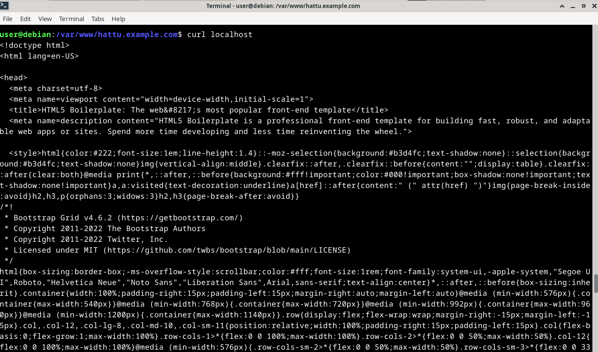

# H3 hello web server

Tehtävänannot kaikki löytyneet [Tero Karvisen Linux Palvelimet -kurssin kotisivulta](https://terokarvinen.com/linux-palvelimet/)

### Tiivistelmät

- **Name-Based Virtual Host**eilla voidaan hostata useampaa weppisivua siten, että jokaisella on sama IP-osoite[^1][^2].
- Jokainen VirtualHost määritellään `<VirtualHost>`-blokilla, jossa domainille annetaan nimi **ServerName**:lla.[^2]
- Jos pyyntö ei vastaa yhtäkään määriteltyä domainin nimeä, Apache palvelee ensimmäisen hostin, joka konfiguraatiosta löytyy.[^2] Suositeltavaa luoda siis defaultti, johon Apache voi ohjata ilman, että käyttäjä päätyy tälle tarkoittamattomalle sivulle.

### weppipalvelin

Apache asennettiin jo tunnilla (**sudo apt install apache2**). Aloitetaan tarkastamalla, että **apache2** on käynnissä.

Kun Apache huomataan olevan käynnissä, voidaan käydä tarkastamassa **localhost** esim firefoxilla. Näyttää toimivan!

Kun käytiin firefoxilla katsomassa **localhost**ia, päivittyi apache2:n **access.log**in tiedot.

Ohessa näkyy myös, kun **localhost** käytiin vain painamassa _F5_ joka päivitti sivun, niin **access.log**iin on tullut lisää tietoa. Logissa huomataan, että firefox yrittää etsiä jos verkkosivulla olisi tarjolla iconeita näkyville. Näistä tietysti epäonnistuvat suurin osa, kun näitä ei ole sivulle asetettu, joten siitä tulee **404 Not Found**.

Ainut iconi joka näyttää löytyvän (**200 OK**) on _/icons/openlogo-75.png_, joka taitaa olla apache2:n oma iconi debianille (https://www.apache.org/icons/openlogo-75.png), joka tulee esille default sivulla.

Tietysti myös **200 OK**:n saavat itse weppisivun tekstisisältö niin kauan kuin se on olemassa.

Seuraavissa kuvissa alettu tekemään etusivua uusiksi. Ensiksi menty **/etc/apache2/**-kansioon, jossa luotu **hattu.example.com.conf**-tiedosto, joka täytetty kuvassa nähdyn **cat**-komennon tulosteella. Tämän jälkeen **a2dissite**, jolla oletussivu poistetaan. Tämän jälkeen **a2ensite**, jolla uusi oletussivu asetetaan **hattu.example.com**iksi. Tämän jälkeen käynnistetään apache uusiksi.


Noniin, verkkosivun etusivu muuttui. Tällä hetkellä ei löydy mitään, koska hakemistoa ei ole luotu tälle verkkosivulle.


Luodaan **/var/www/hattu.example.com** niminen hakemisto.

Nyt näkyy, että **localhost**illa päästään katsomaan tätä hakemistoa. Hakemistosta puuttuu vielä **index.html**, joten mitään varsinaista HTML-sivua ei ole.

Luodaan **index.html** joka täytetty **cat**-komennon näyttämällä tavalla.

Ja sama teksti kuin edellä näkyy myös nyt **localhost**illa.

Jotta verkkosivu saadaan HTML5-sivuksi, täytyy se täyttää esimerkiksi netistä löytyvällä HTML5 boilerplatella. curlatun boilerplate index.html:ään olen vielä tehnyt muutoksen, jossa näkyy teksti "_Hello World! t. hattu.example.com_".


Komento **curl localhost** hakee weppisivun tiedot suoraan niin kuin ne palvellaan selaimessa.

Komento **curl -I localhost** näyttää weppisivun "esitiedot"


### Ympäristötiedot

#### CPU Information:

- Architecture: x86_64
- Model: 12th Gen Intel(R) Core(TM) i5-12600K
- Cores/Threads: 10 cores, 16 threads
- Virtualization: VT-x enabled
- Max Frequency: 4.9 GHz

#### Memory Info:

- Total: 31GB
- Used: 4.2GB
- Available: 26GB
- Swap: 8GB

#### Disk Info:

- Samsung 980 PRO SSD 1TB M.2 - SSD

#### Operating System Info:

- Ubuntu 24.04.1 LTS (Codename: noble)
- Kernel: 6.8.0-51-generic

#### VirtualBox Version:

- 7.0.16_Ubuntur162802

#### GPU Information:

```
+-----------------------------------------------------------------------------------------+
| NVIDIA-SMI 550.120                Driver Version: 550.120        CUDA Version: 12.4     |
|-----------------------------------------+------------------------+----------------------+
| GPU  Name                 Persistence-M | Bus-Id          Disp.A | Volatile Uncorr. ECC |
| Fan  Temp   Perf          Pwr:Usage/Cap |           Memory-Usage | GPU-Util  Compute M. |
|                                         |                        |               MIG M. |
|=========================================+========================+======================|
|   0  NVIDIA GeForce RTX 3080        Off |   00000000:01:00.0  On |                  N/A |
|  0%   37C    P5             34W /  340W |     623MiB /  10240MiB |      2%      Default |
|                                         |                        |                  N/A |
+-----------------------------------------+------------------------+----------------------+
```

[^1]: Name-based Virtual Host Support, Apache, https://httpd.apache.org/docs/2.4/vhosts/name-based.html
[^2]: Name Based Virtual Hosts on Apache – Multiple Websites to Single IP Address, Tero Karvinen, 2018, https://terokarvinen.com/2018/04/10/name-based-virtual-hosts-on-apache-multiple-websites-to-single-ip-address/
