# H4 Maailma kuulee

Tehtävänannot kaikki löytyneet [Tero Karvisen Linux Palvelimet -kurssin kotisivulta](https://terokarvinen.com/linux-palvelimet/)

## Tiivistelmät x)

- Ehdotetaan käyttämään lukuisia erilaisia palvelun tarjoajia VPS:n hostaamiseen mm. DigitalOcea, Linode ja Gandi.[^2]
- Palvelimelle yhdistäminen onnistuu komennolla `ssh root@[IP osoite]`[^1]
- Palomuurin käyttöönotto ja konfigurointi yksinkertaisimmillaan: tehdään SSH-yhteydelle palomuuriin reikä `sudo ufw allow 22/tcp` ja sen jälkeen palomuuri päälle siten, että kaikki muut yhteydet kielletään `sudo ufw enable`[^1][^2]
- Ennen root-käyttäjän sulkemista pitää tehdä uusi käyttäjä, jolla hieman vähemmän oikeuksia[^1][^2]
  ```
  sudo adduser [käyttäjänimi]
  sudo adduser [käyttäjänimi] sudo
  sudo adduser [käyttäjänimi] adm
  sudo adduser [käyttäjänimi] admin
  ```
  jonka jälkeen on hyvä kokeilla onnistuuko SSH tällä uudella käyttäjällä palvelimelle `ssh [käyttäjänimi]@[IP osoite]`
- Suljetaan root-käyttäjä komennoilla[^2]
  ```
  sudo usermod --lock root
  sudoedit /etc/ssh/sshd_config
  # ...
  PermitRootLogin no
  # ...
  sudo service ssh restart
  ```
- Palvelinta kannattaa päivittää..[^2]
  ```
  sudo apt-get update
  sudo apt-get upgrade
  ```
- Jos haluat päästä palvelimelle myös http- ja https-yhteyksillä:[^2]
  ```
  sudo ufw allow 80/tcp
  sudo ufw allow 443/tcp
  ```

## Palvelin

- a)

> Tehtävänanto:
> **Vuokraa oma virtuaalipalvelin haluamaltasi palveluntarjoajalta. (Vaihtoehtona voit käyttää ilmaista kokeilujaksoa, GitHub Education krediittejä; tai jos mikään muu ei onnistu, voit kokeilla ilmaiseksi vagrant:ia paikallisesti. Suosittelen kuitenkin harjoittelemaan oikeilla, tuotantoon kelpaavilla julkisilla palveluilla).**

Virtuaalipalvelimen vuokrasin [UpCloudista](upcloud.com). Kun käyttäjä on luotu, voidaan mennä UpCloudin [Dashboardiin](https://hub.upcloud.com/dashboard).

Dashboardissa valitaan **Deploy now** ja valitaan dropdownista **Server**. Palvelimen lokaatioksi valitsin itse **FI-HEL1**. Plan-kohdassa otin halvimman mahdollisen vaihtoehdon. Operating system valittiin **Debian GNU/Linux 12 (Bookworm)**, koska se on ennestään tuttu.

Login methodina käytetty **SSH keys**. Jotta tämä saadaan käyttöön, tulee palvelimelle luoda uudet SSH avaimet painamalla **Add new**. Seuraavaksi tarvitaan päätettä.

Päätteellä kirjoitetaan `ssh-keygen`, joka avaa interaktiivisen ohjelman, joka kysyy muutamia tietoja:

1. Oletuksena avaimet luodaan käyttäjän kotihakemiston `.ssh`-kansioon. Painamalla enter ensimmäisessä kyselyssä, ohjelma käyttää oletuspolkua.
2. Ohjelma kysyy, haluatko suojata yksityisen avaimen salasanalla (passphrase). Tähän voi vastata haluamallaan salasanalla, tai antaa sen olla tyhjä. Enteriä painamalla pääsee tästä eteenpäin.

Ohjelman valmistuttua pitäisi näkyä jota kuinkin alla olevan kuvan näköinen tilanne, jossa ohjelma on luonut (minun tapauksessani) `id_rsa_test` ja `id_rsa_test.pub` -nimiset tiedostot, joita kutsutaan avainpariksi.[^4] Näistä ensimmäinen on avainparin yksityinen avain, jota **ei saa** näyttää kenellekään, eikä mieluusti saa kopioida mihinkään.
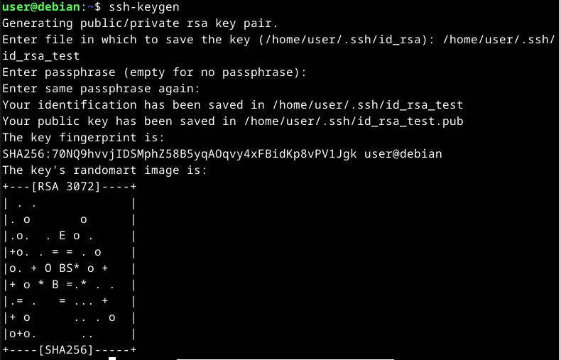

Kun avainparin generointi on valmis, voidaan siirtää avainparin julkisen osan sisältö UpCloudiin. Otetaan julkinen avain talteen

```
cat /home/user/.ssh/id_rsa_test.pub
```

josta otetaan kopio. Jatketaan UpCloudin sivulla, jossa **Add new** nappulaa on viimeksi painettu, ja esillä pitäisi olla ponnahdusikkuna, jossa kysytään SSH avaimen nimeä ja sisältöä. Laitetaan nimeksi mitä halutaan, ja SSH key -kohtaan laitetaan edellisen komennon sisältö kokonaisuudessaan.

Tämän jälkeen voidaan jatkaa sivun loppuun asti, painetaan **Deploy** ja odotetaan kunnes palvelu on saanut palvelimemme pystyyn.

UpCloudin [Servers](https://hub.upcloud.com/server) lehdykällä voi nähdä juuri deployatun palvelimen, kun se on valmis. Tältä sivulta otetaan IP-osoite talteen jotta voidaan kirjautua siihen SSH:lla seuraavaksi komennolla

```
ssh root@[IP osoite]
```

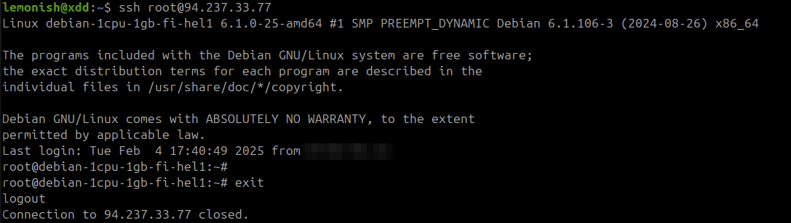
Kuvassa ajettu komennot

```
$ ssh root@94.237.33.77
root@debian-1cpu-1gb #exit
```

- b)
  > Tehtävänanto:
  > **Tee alkutoimet omalla virtuaalipalvelimellasi: tulimuuri päälle, root-tunnus kiinni, ohjelmien päivitys.**

---

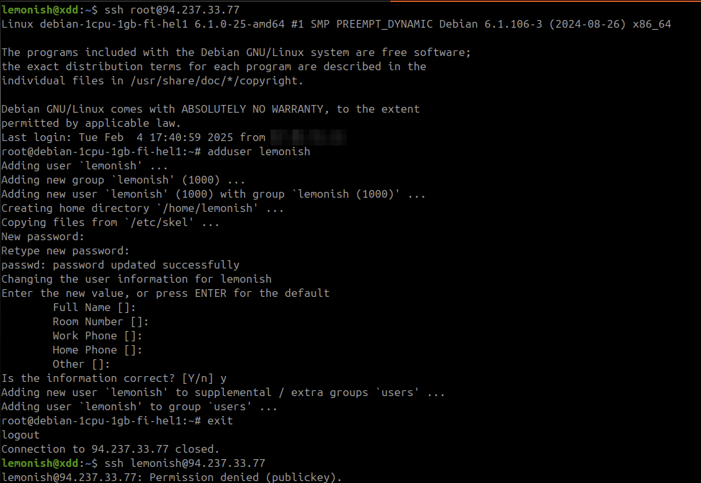

Uuden käyttäjän luonti komennolla:

```
adduser lemonish
```

Kuvassa ajettu komennot:

```
$ ssh root@94.237.33.77
root@debian-1cpu-1gb # adduser lemonish
root@debian-1cpu-1gb # exit
$ ssh lemonish@94.237.33.77
Permission denied (publickey).
```

---

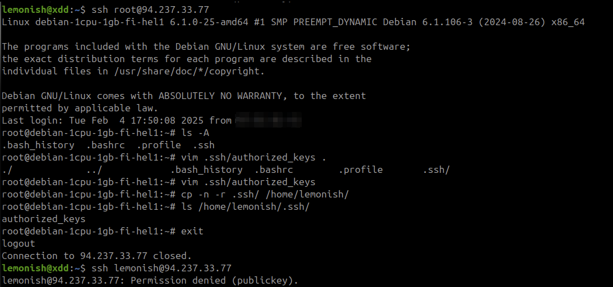

Käyttäjän `lemonish` SSH-pääsyä varten kopioitiin `authorized_keys`:

```
cp -r .ssh/ /home/lemonish/
```

Kuvassa ajettu komennot:

```
$ ssh root@94.237.33.77
root@debian-1cpu-1gb # ls -A
root@debian-1cpu-1gb # cp -r .ssh/ /home/lemonish/
root@debian-1cpu-1gb # ls /home/lemonish/.ssh/
root@debian-1cpu-1gb # exit
$ ssh lemonish@94.237.33.77
Permission denied (publickey).
```

---

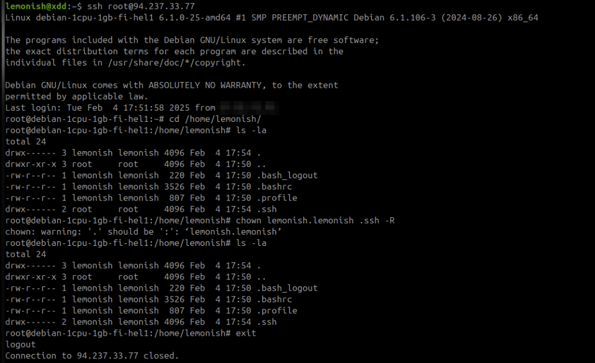

Korjattiin oikeudet komennolla:

```
chown lemonish.lemonish .ssh -R
```

Kuvassa ajettu komennot:

```
$ ssh root@94.237.33.77
root@debian-1cpu-1gb # cd /home/lemonish/
root@debian-1cpu-1gb # ls -la
root@debian-1cpu-1gb # chown lemonish.lemonish .ssh -R
root@debian-1cpu-1gb # ls -la
root@debian-1cpu-1gb # exit
```

Testattiin käyttäjän `lemonish` pääsy SSH:lla:

```
ssh lemonish@94.237.33.77
```

Joka onnistui tällä kertaa.

---

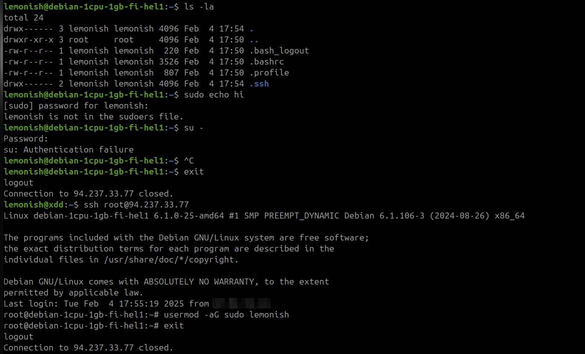

Lisättiin käyttäjä sudo-ryhmään, koska `sudo echo hi` ei toiminut:

```
$ ssh root@94.237.33.77
root@debian-1cpu-1gb-fi-hel1:~# usermod -aG sudo lemonish
root@debian-1cpu-1gb-fi-hel1:~# exit
logout
```

Kuvassa ajettu komennot:

```
lemonish@debian-1cpu-1gb-fi-hel1:~$ sudo echo hi
lemonish is not in the sudoers file.
lemonish@debian-1cpu-1gb-fi-hel1:~$ su -
Authentication failure
lemonish@debian-1cpu-1gb-fi-hel1:~$ exit
logout
$ ssh root@94.237.33.77
root@debian-1cpu-1gb-fi-hel1:~# usermod -aG sudo lemonish
root@debian-1cpu-1gb-fi-hel1:~# exit
logout
```

---

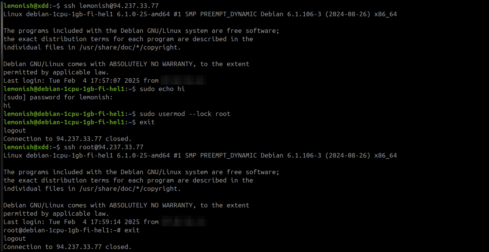

Lukittiin root-käyttäjä komennolla[^1][^2]:

```
$ ssh lemonish@94.237.33.77
lemonish@debian-1cpu-1gb-fi-hel1:~$ sudo echo hi
lemonish@debian-1cpu-1gb-fi-hel1:~$ sudo usermod --lock root
lemonish@debian-1cpu-1gb-fi-hel1:~$ exit
logout
```

Jonka jälkeen testattiin pääseekö roottiin sisään. Edelleen pääsi, eli vielä on konfiguroitavaa.

---

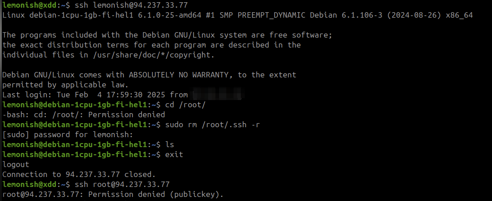

Poistettiin rootin SSH-avaimet ja testattiin pääsyä:

```
$ ssh lemonish@94.237.33.77
lemonish@debian-1cpu-1gb-fi-hel1:~$ cd /root/
-bash: cd: /root/: Permission denied
lemonish@debian-1cpu-1gb-fi-hel1:~$ sudo rm /root/.ssh -r
lemonish@debian-1cpu-1gb-fi-hel1:~$ ls
lemonish@debian-1cpu-1gb-fi-hel1:~$ exit
logout
```

Nyt roottiin ei pääse enää SSH:lla kirjautumaan (Permission denied).

---

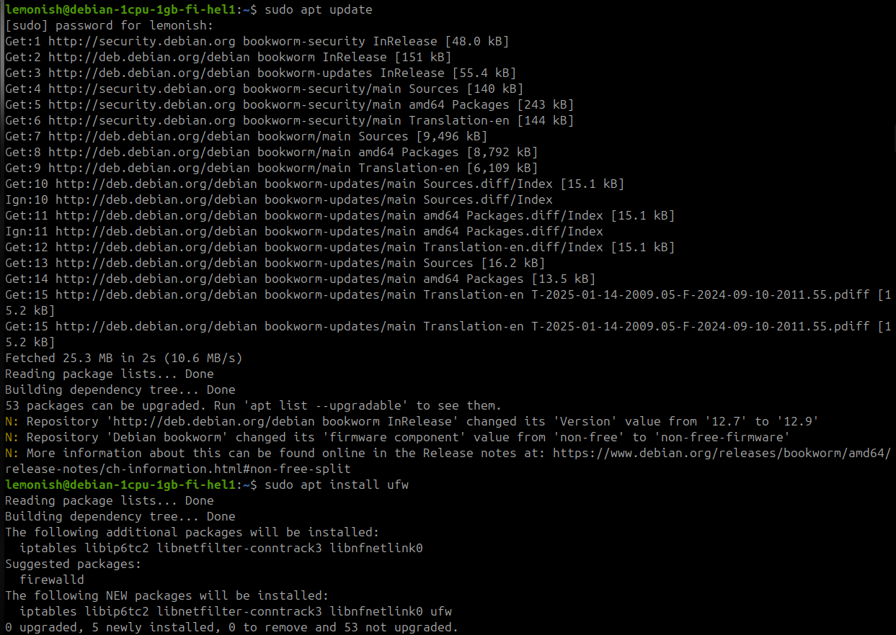

Päivitettiin järjestelmä ja asennettiin `ufw`[^1][^2]:

```
$ ssh lemonish@94.237.33.77
lemonish@debian-1cpu-1gb-fi-hel1:~$ sudo apt update
lemonish@debian-1cpu-1gb-fi-hel1:~$ sudo apt install ufw
```

---

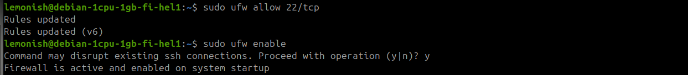

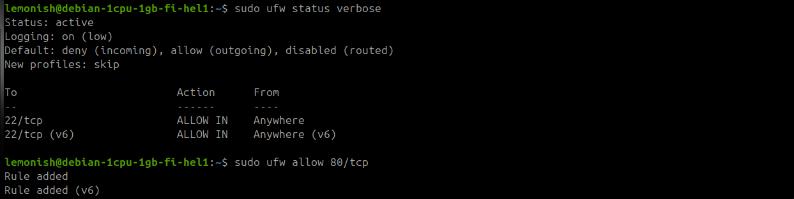

Sallittiin portit 22 ja 80 palomuurissa[^1][^2][^3]:

```
$ ssh lemonish@94.237.33.77
lemonish@debian-1cpu-1gb-fi-hel1:~$ sudo ufw allow 22/tcp
lemonish@debian-1cpu-1gb-fi-hel1:~$ sudo ufw enable
lemonish@debian-1cpu-1gb-fi-hel1:~$ sudo ufw status verbose
lemonish@debian-1cpu-1gb-fi-hel1:~$ sudo ufw allow 80/tcp
```

- c)
  > Tehtävänanto:
  > **Asenna weppipalvelin omalle virtuaalipalvelimellesi. Korvaa testisivu. Kokeile, että se näkyy julkisesti. Kokeile myös eri koneelta, esim kännykältä. (Jos haluat tehdä oikeat weppisivut, tarvitset Name Based Virtual Hostin)**

---

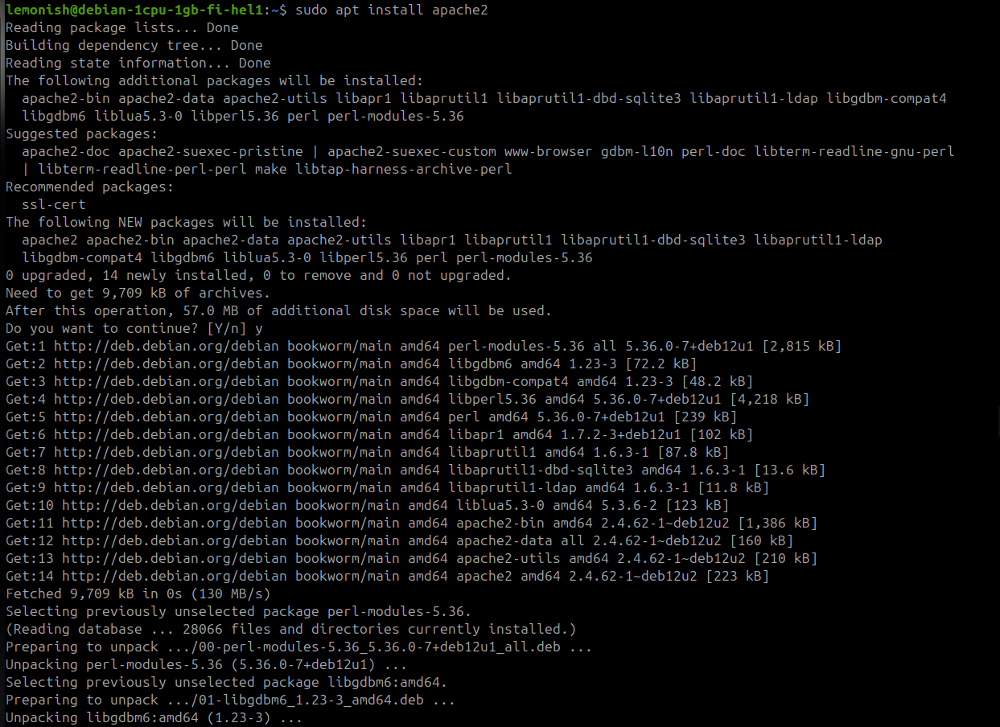

Asennettiin Apache2 [^1]:

```
$ ssh lemonish@94.237.33.77
lemonish@debian-1cpu-1gb-fi-hel1:~$ sudo apt install apache2
```

---

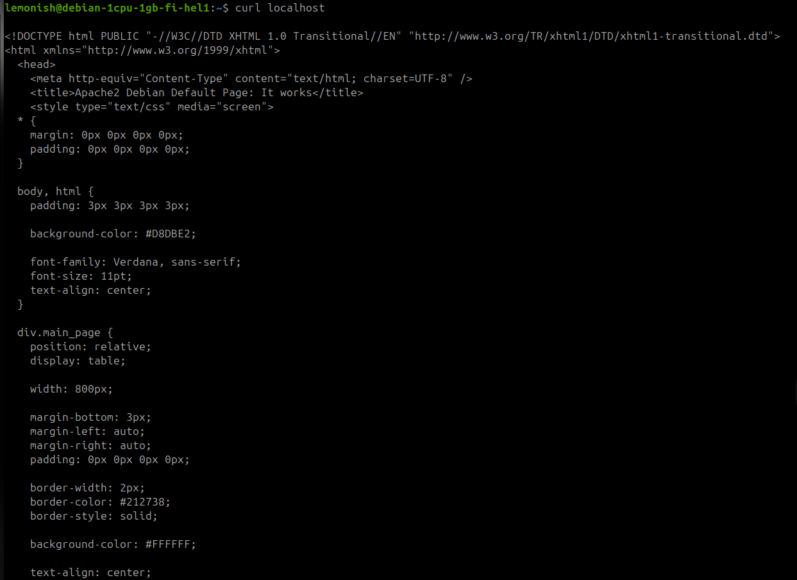

Testattiin Apache2-palvelimen toimivuus:

```
$ ssh lemonish@94.237.33.77
lemonish@debian-1cpu-1gb-fi-hel1:~$ curl localhost
```

---

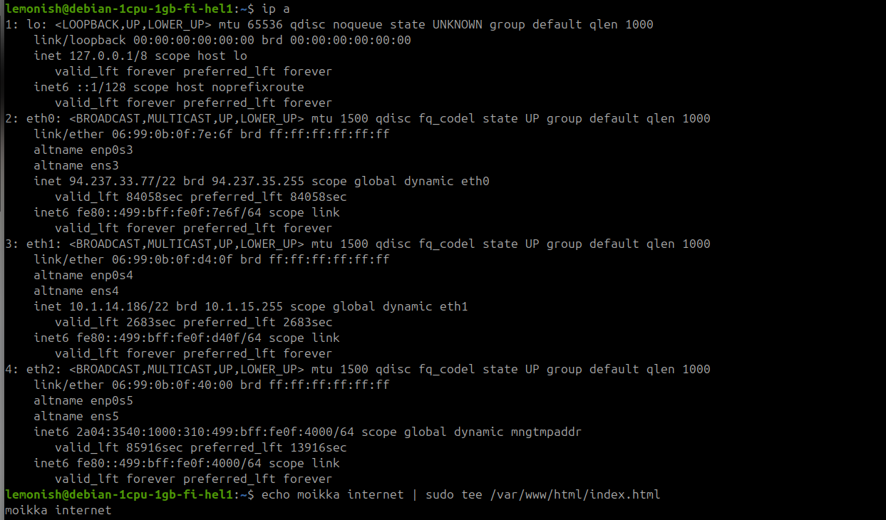

Näytettiin verkkoliittymät ja muokattiin HTML-tiedostoa[^1]:

```
$ ssh lemonish@94.237.33.77
lemonish@debian-1cpu-1gb-fi-hel1:~$ ip a
lemonish@debian-1cpu-1gb-fi-hel1:~$ echo moikka internet | sudo tee /var/www/html/index.html
```

---

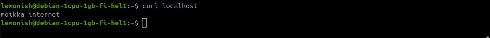

Testattiin HTML-sivua paikallisesti palvelimella komennolla:

```
$ ssh lemonish@94.237.33.77
lemonish@debian-1cpu-1gb-fi-hel1:~$ curl localhost
```

---

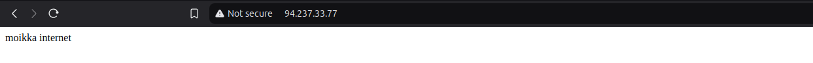

Avaamalla selain toisella tietokoneella osoitteessa http://94.237.33.77 näkyi yllä olevasta kuvasta, että teksti näkyy muuallekin maailmalle:

---

## Ympäristötiedot

#### CPU Information:

- Architecture: x86_64
- Model: 12th Gen Intel(R) Core(TM) i5-12600K
- Cores/Threads: 10 cores, 16 threads
- Virtualization: VT-x enabled
- Max Frequency: 4.9 GHz

#### Memory Info:

- Total: 31GB
- Used: 4.2GB
- Available: 26GB
- Swap: 8GB

#### Disk Info:

- Samsung 980 PRO SSD 1TB M.2 - SSD

#### Operating System Info:

- Ubuntu 24.04.1 LTS (Codename: noble)
- Kernel: 6.8.0-51-generic

#### VirtualBox Version:

- 7.0.16_Ubuntur162802

#### GPU Information:

```
+-----------------------------------------------------------------------------------------+
| NVIDIA-SMI 550.120                Driver Version: 550.120        CUDA Version: 12.4     |
|-----------------------------------------+------------------------+----------------------+
| GPU  Name                 Persistence-M | Bus-Id          Disp.A | Volatile Uncorr. ECC |
| Fan  Temp   Perf          Pwr:Usage/Cap |           Memory-Usage | GPU-Util  Compute M. |
|                                         |                        |               MIG M. |
|=========================================+========================+======================|
|   0  NVIDIA GeForce RTX 3080        Off |   00000000:01:00.0  On |                  N/A |
|  0%   37C    P5             34W /  340W |     623MiB /  10240MiB |      2%      Default |
|                                         |                        |                  N/A |
+-----------------------------------------+------------------------+----------------------+
```

---

## Lähteet

[^1]: Teoriasta käytäntöön pilvipalvelimen avulla, https://susannalehto.fi/2022/teoriasta-kaytantoon-pilvipalvelimen-avulla-h4/
[^2]: First steps on a new virtual private server, an example on digitalocean, https://terokarvinen.com/2017/first-steps-on-a-new-virtual-private-server-an-example-on-digitalocean/
[^3]: How to Set Up a Firewall with UFW on Ubuntu, https://www.digitalocean.com/community/tutorials/how-to-set-up-a-firewall-with-ufw-on-ubuntu
[^4]: How to Use ssh-keygen to Generate a New SSH Key?, https://www.ssh.com/academy/ssh/keygen
