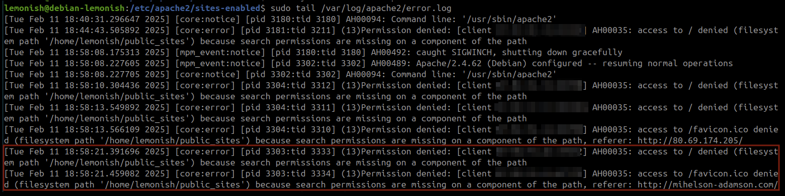

# H5 Nimekäs

Tehtävänannot kaikki löytyneet [Tero Karvisen Linux Palvelimet -kurssin kotisivulta](https://terokarvinen.com/linux-palvelimet/)

## Oma kotisivu

- a)
  > Tehtävänanto:
  > **Nimi. Laita julkinen nimi osoittamaan omaan koneeseesi. (Siis vastaava kuin terokarvinen.com. Nimen saattaa saada myös ilmaiseksi Github Education -paketilla. Suosittelen hankkimaan oikean nimen, mutta jos välttämättä haluat, voit myös simuloida nimen toimintaa paikallisesti hosts-tiedoston avulla.)**

Jotta tehtävä voidaan aloittaa, täytyy ensin vuokrata julkinen nimi. Nimi vuokrataan tässä tapauksessa Namecheapista[^1]. Sivulle täytyy rekisteröityä ja lisätä omat maksutiedot, tässä voi mennä jonkun verran aikaa.

Kun rekisteröityminen ja maksutietojen anto on suoritettu, voi domain nimen etsintää aloittaa sivulla https://www.namecheap.com/domains/.

Kun oman domain nimen on saanut vuokrattua, mennään namecheapin [dashboardista](https://ap.www.namecheap.com/) tarkastelemaan tätä vuokrattua domain nimeä. Domain nimen kohdalta painetaan oikealta "Manage"-nappia joka avaa domain nimen asetukset. Asetuksissa painetaan oman domain nimen alla näkyvässä otsakkeessa "Advanced DNS", josta aukeaa tarkemmat asetukset domain nimelle.

Advanced DNS -sivulla painetaan "ADD NEW RECORD" jolle valitaan typeksi "A Record" ja hostiksi "@" ja lisätään valueksi oman palvelimen IP-osoite. Sama toistetaan ja laitetaan hostiksi myös "www".


Tämän kun on tehnyt, niin nyt domain nimi pitäisi osoittaa omaan palvelimeen.

---

- b)
  > Tehtävänanto:
  > **Based. Laita Name Based Virtual Host näkymään uudessa nimessäsi. Kotisvuja pitää pystyä muokkaamaan ilman pääkäyttäjän oikeuksia.**


Luotiin Virtual Host -konfiguraatio Apache-palvelimeen tiedostoon `/etc/apache2/sites-available/mihelson-adamson.com.conf`:

```bash
cd /etc/apache2/sites-available
sudo vim mihelson-adamson.com.conf
```


Määriteltiin virtual host -asetukset:

```apache
<VirtualHost *:80>
    ServerName mihelson-adamson.com
    DocumentRoot /home/lemonish/public_sites/mihelson-adamson.com

    <Directory /home/lemonish/public_sites/mihelson-adamson.com>
        Require all granted
    </Directory>
</VirtualHost>
```

Muistetaan myös tehdä kotihakemistoon kansio:

```bash
mkdir /home/lemonish/public_sites/mihelson-adamson.com
```

ja tuonne kansioon laitetaan `index.html` tiedosto, jonka sisältö pelkkä `hello world`:

```bash
echo "hello world" > /home/lemonish/public_sites/mihelson-adamson.com/index.html
```


Otetaan käyttöön uusi konfiguraatio:

```bash
sudo a2ensite mihelson-adamson.com.conf
sudo systemctl restart apache2
```


Tarkistettiin asetusten toimivuus:

```bash
curl mihelson-adamson.com
```

curl-komento ei antanut oikeaa palautusta, palautus taitaa olla DNS-hostin Namecheapin antama vastaus. Unohdin luoda verkkosivuhakemiston..


Käyttäjien omien verkkosivuhakemistojen tuki (`userdir`) otettiin käyttöön:

```bash
sudo a2enmod userdir
sudo systemctl restart apache2
```



Virheloki osoitti, että käyttöoikeudet estivät pääsyn verkkosivustoon:

```bash
sudo tail /var/log/apache2/error.log
```

Virhe:

```
access to / denied (filesystem path '/home/lemonish/public_sites')
```


Tarkistettiin hakemistojen oikeudet:

```bash
ls -ld /home/lemonish/public_sites/
ls -ld /home/lemonish/
```

Huomattiin, että `/home/lemonish/` hakemiston oikeudet estivät Apachen pääsyn.


Korjattiin hakemistojen käyttöoikeudet:

```bash
chmod o=rx /home/lemonish/
chmod g=rx /home/lemonish/
```

Varmistettiin, että Apache pääsee hakemistoihin:

```bash
ls -ld /home/lemonish/
```


Lopuksi testattiin, että sivusto toimii:

```bash
sudo systemctl restart apache2
curl mihelson-adamson.com
```

Nyt curl tulostaa odotetun sisällön.

---

- c)
  > Tehtävänanto:
  > **Kotisivu. Tee vähintään kolmen erillisen alasivun (esim. index.html, blog.html, projects.html) kotisivu ja kopioi se näkymään palvelimellesi. Sivujen muokkaamisen pitää onnistua ilman pääkäyttäjän oikeuksia, niiden kopioiminen pääkäyttäjänä testisivun paikalle ei käy. Kotisivujen ei tarvitse olla hienoja, mutta niiden tulee olla validia HTML:ää ja linkittää toisiinsa.**

Sivuston HTML-tiedostot sijoitettiin kotihakemistoon, jotta niitä voidaan muokata ilman pääkäyttäjän oikeuksia. Sitten avattiin blog.html muokattavaksi:


Kun blogisivu on valmis, voidaan käyttää sitä pohjana muille sivuille. Kopioitiin blog.html-tiedosto kahdeksi muuksi alasivuksi:


Testataan kaikkien sivujen sisällön näkyminen selaimessa:


Kaikki toimii, linkitkin toimii!

---

- d)
  > Tehtävänanto:
  > **Alidomain. Tee kaksi uutta alidomainia, jotka osoittava omaan koneeseesi. Esimerkiksi palvelu on example.com -> linuxkurssi.example.com. Alidomainit ovat tyypillisesti ilmaisia, kun sinulla on päädomain (example.com). Tässä tehtävässä riittää, että alidomainit avaavat saman sivun kuin päädomain. (Vapaaehtoinen bonus: Tee toinen alidomain A-tietueella ja toinen CNAME-tietueella. Vapaaehtoinen bonus: tee alidomainiin oma erillinen name based virtual host.)**

DNS-asetuksissa luotiin kaksi uutta A-tietueen alidomainia, jotka osoittavat päädomainin IP-osoitteeseen 80.69.174.205:


Testattiin pääsy alidomaineihin selaimessa, molemmat avaavat saman sivun kuin päädomain, mikä oli tehtävän tavoitteena.


---

- e)
  > Tehtävänanto:
  > **Tutki jonkin nimen DNS-tietoja 'host' ja 'dig' -komennoilla. Käytä kumpaakin komentoa kaikkiin nimiin ja vertaa tuloksia. Katso man-sivulta, miten komennot toimivat - esimerkiksi miten 'dig' näyttää kaikki kentät. Analysoi tulokset, keskity nimipalvelimelta tulleisiin kenttiin (dig näyttää paljon muutakin tietoa). Etsi tarvittaessa uusia lähteitä haastaviin kohtiin. Sähköpostin todentamiseen liittyvät SPF ja DMARC -tietojen yksityiskohdat on jätetty vapaaehtoiseksi lisätehtäväksi. Tutkittavat nimet:**

> - **Oma domain-nimesi. Vertaa tuloksia nimen vuokraajan (namecheap.com, name.com...) weppiliittymässä näkyviin asetuksiin.**


Tarkistettiin `mihelson-adamson.com` DNS-tiedot.

- `A`-tietue osoittaa IP:hen 80.69.174.205.
- `MX`-tietueet viittaavat Namecheapin sähköpostin edelleenlähetyspalveluun[^2].

---

> - **Jonkin pikkuyrityksen, kerhon tai yksittäisen henkilön weppisivut. (Ei kuitenkaan kurssikaverin tällä viikolla vuokrattua nimeä).**


Tarkistettiin `iltalehti.fi` DNS-tiedot.

- `A`-tietueissa on neljä eri IPv4-osoitetta, eli domainilla on DNS-pohjainen kuormantasaus[^5].
- `MX`-tietue osoittaa Outlookin sähköpostipalveluun, joten sähköpostiliikenne kulkee Microsoftin kautta.
- Iltalehdellä löytyy myös IPv6-osoitteita.

---

> - **Jonkin suuren ja kaikkien tunteman palvelun tiedot.**


Tarkistettiin `youtube.com` DNS-tiedot:

- `A`-tietue palauttaa vain yhden IPv4-osoitteen, vaikuttaa siltä, että YouTube käyttää Anycast-verkkoa[^6].
- Anycastin ansiosta sama IP-osoite voi viitata moniin eri palvelimiin, riippuen mistä pyyntö tehdään[^6].
- `MX`-tietue osoittaa Google SMTP -palvelimeen, joka hoitaa sähköpostiliikenteen.
- IPv6 on käytössä, Google tukee molempia protokollia.

Tarkistin vielä kaikkien näiden domainien nameserver tiedot `host -t NS` -komennolla


Huomataan, että Youtubella on Googlen omat nameserverit. Omalla domainillani on namecheapin registrar-servers nameserver. Iltalehdellä taas toimii AWS nameserverinä.

---

## Ympäristötiedot

#### CPU Information:

- Architecture: x86_64
- Model: 12th Gen Intel(R) Core(TM) i5-12600K
- Cores/Threads: 10 cores, 16 threads
- Virtualization: VT-x enabled
- Max Frequency: 4.9 GHz

#### Memory Info:

- Total: 31GB
- Used: 4.2GB
- Available: 26GB
- Swap: 8GB

#### Disk Info:

- Samsung 980 PRO SSD 1TB M.2 - SSD

#### Operating System Info:

- Ubuntu 24.04.1 LTS (Codename: noble)
- Kernel: 6.8.0-51-generic

#### VirtualBox Version:

- 7.0.16_Ubuntur162802

#### GPU Information:

```
+-----------------------------------------------------------------------------------------+
| NVIDIA-SMI 550.120                Driver Version: 550.120        CUDA Version: 12.4     |
|-----------------------------------------+------------------------+----------------------+
| GPU  Name                 Persistence-M | Bus-Id          Disp.A | Volatile Uncorr. ECC |
| Fan  Temp   Perf          Pwr:Usage/Cap |           Memory-Usage | GPU-Util  Compute M. |
|                                         |                        |               MIG M. |
|=========================================+========================+======================|
|   0  NVIDIA GeForce RTX 3080        Off |   00000000:01:00.0  On |                  N/A |
|  0%   37C    P5             34W /  340W |     623MiB /  10240MiB |      2%      Default |
|                                         |                        |                  N/A |
+-----------------------------------------+------------------------+----------------------+
```

## Lähteet

[^1]: [Namecheap](https://www.namecheap.com/)
[^2]: [Namecheap Email Forwarding](https://www.namecheap.com/support/knowledgebase/article.aspx/308/2214/how-to-set-up-free-email-forwarding/)
[^5]: [What is DNS-based load balancing?](https://www.cloudflare.com/learning/performance/what-is-dns-load-balancing/)
[^6]: [What is Anycast? | How does Anycast work?](https://www.cloudflare.com/learning/cdn/glossary/anycast-network/)
