# H6 Salataampa

Tehtävänannot kaikki löytyneet [Tero Karvisen Linux Palvelimet -kurssin kotisivulta](https://terokarvinen.com/linux-palvelimet/)

- x)

  > Tehtävänanto:
  > **Lue ja tiivistä. Tiivistelmäksi riittää muutama ranskalainen viiva per artikkeli. (Tässä alakohdassa ei tarvitse tehdä testejä tietokoneella)**
  >
  > - **Let's Encrypt 2024: How It Works**:

  - Let’s Encrypt on ilmainen, automatisoitu ja avoin varmenneviranomainen, joka tarjoaa HTTPS-salausta tukevia digitaalisia varmenteita.
  - Se käyttää ACME-protokollaa varmistaakseen verkkotunnuksen omistajuuden ja automatisoi varmenteiden myöntämisen sekä uusimisen.
  - Palvelu edistää Internetin turvallisuutta tarjoamalla helposti saatavilla olevia ja kustannustehokkaita ratkaisuja salatun liikenteen mahdollistamiseksi.
  - Automatisoitu prosessi vähentää inhimillisiä virheitä ja tukee laajamittaista käyttöönottoa ilman monimutkaisia manuaalisia toimenpiteitä.

  > - **Lange 2024: Lego: Obtain a Certificate: Using an existing, running web server (vain tämä kappale, ei "Running a script afterward" tai myöhempiä)**:

  - LEGO on ACME-protokollaa hyödyntävä komentorivipohjainen työkalu, jolla voi hakea SSL-varmenteita.
  - Varmenteen hakeminen tapahtuu suorittamalla `lego run` -komento, johon lisätään tarvittavat liput, kuten sähköpostiosoite ja verkkotunnukset.
  - Tarvittaessa SSL-varmenteen voi laittaa uusiutumaan automaattisesti

  > - **The Apache Software Foundation 2025: Apache HTTP Server Version 2.4 [Official] Documentation: SSL/TLS Strong Encryption: How-To: Basic Configuration Example (Ei "Cipher Suites and Enforcing Strong Security" eteenpäin. Name based virtual host -tiedostossa tarvitset vain SSLEngine, SSLCertificateFile ja SSLCertificateKeyFile -asetukset)**:

  - Config-tiedostossa täytyy vähintään olla seuraavat rivit:

  ```
  <VirtualHost *:443>
      ServerName www.example.com
      SSLEngine on
      SSLCertificateFile "/path/to/www.example.com.cert"
      SSLCertificateKeyFile "/path/to/www.example.com.key"
  </VirtualHost>
  ```

- a)
  > Tehtävänanto:
  > **Let's. Hanki ja asenna palvelimellesi ilmainen TLS-sertifikaatti Let's Encryptilta. Osoita, että se toimii.**

Ensiksi asennetaan `lego` seuraavalla komennolla

```
sudo apt install lego
```

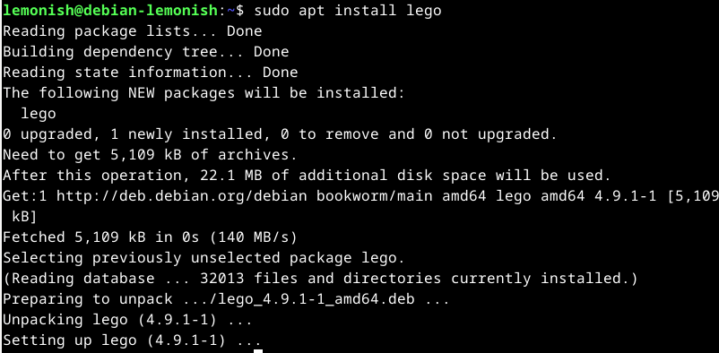

Sen jälkeen tehdään valmiiksi reikä 443-portille

```
sudo ufw allow 443/tcp
```

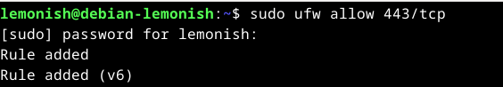

Ensiksi tehdään kotihakemistoon kansio

```
mkdir /home/lemonish/lego
```

Seuraavaksi ajetaan luennolla ja prujuissa[^5] näytetty `lego`-komento

```
lego --accept-tos --email=patrikmihelson@gmail.com --http --http.webroot='/home/lemonish/public_sites/mihelson-adamson.com' --domains=www.mihelson-adamson.com --domains=mihelson-adamson.com --path='/home/lemonish/lego' --pem run
```

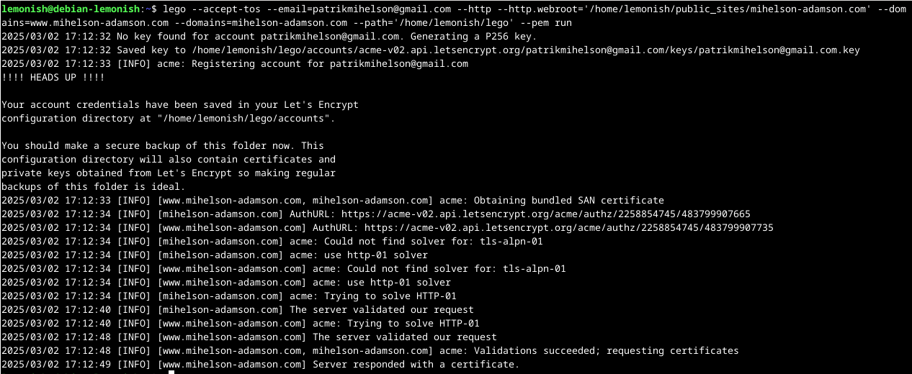

Täytetään `/etc/apache2/sites-available/mihelson-adamson.com.conf`:iin tarvittavat tiedot `VirtualHost *:443` varten. `SSLCertificateFile` ja `SSLCertificateKeyFile` sijainnit löytyvät `lego`-komennon jälkeen kotihakemiston **lego**-kansiosta. Conf-tiedoston täytön ja tallentamisen jälkeen potkaistaan demoni ja katsotaan mitä tapahtuu.
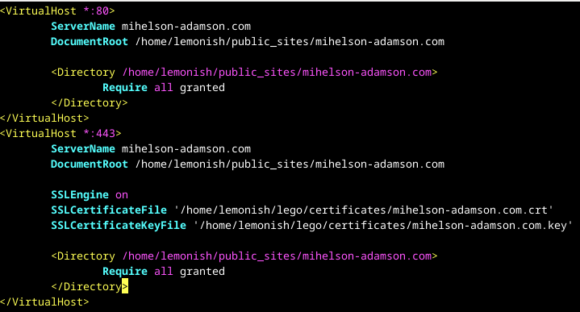

Demonin potkaisun aikana tulee virheilmoitus. Komento ehdottaa tarkastamaan `systemctl status`-komennolla lisätietoja.

```
sudo systemctl restart apache2
sudo systemctl status apache2
```

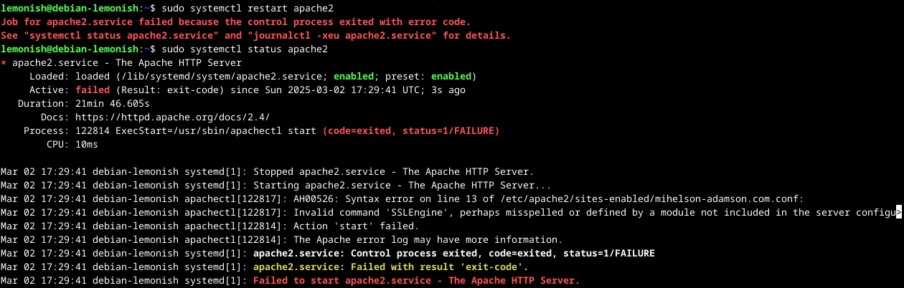

`systemctl status`-komento kertoi vain, että conf-tiedostossa on kirjoitusvirhe rivillä 13. Tarkastetaan vielä apache2:n omalla `configtest`-komennolla tarkemmin.

```
sudo apache2ctl configtest
```

Komento kertoo meille, että virhe löytyykin riviltä 14, ja että haluttua tiedostoa ei löydy!
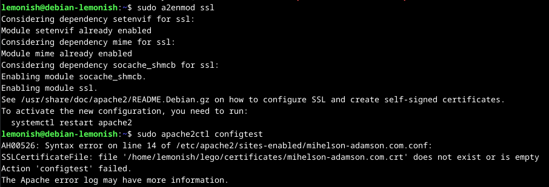

Tarkastetaan kotihakemistossa olevan **lego**-kansiossa **certificate**-kansion sisältö

```
ls -la lego/certificates/
```

Huomataankin virhe.. `SSLCertificateFile` ja `SSLCertificateKeyFile` poluissa puuttui **www**-etuliite, josta apache2 configtesti valitti.
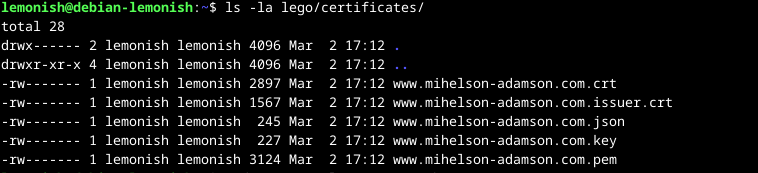

Korjataan **www**-etuliiteet polkuihin..
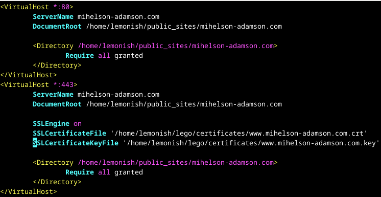

Ajettu uudelleen `configtest`-komento, joka suoriutuu onnistuneesti. Tämän jälkeen demonin potkaisu.
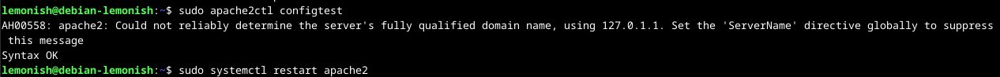

```
curl https://mihelson-adamson.com
```

Testataan näkyykö weppisivun näkymä https:llä ja näkyyhän se!
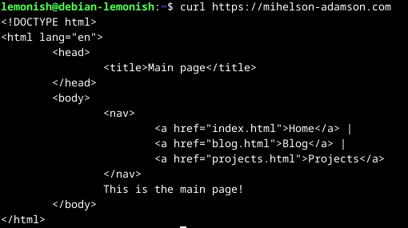

Koska palvelin nyt pelittää ja certti oli kunnossa, pyydettiin ajamaan sama `lego`-komento kuin edellä siten, että on poistettu `--path`-osio komennosta.
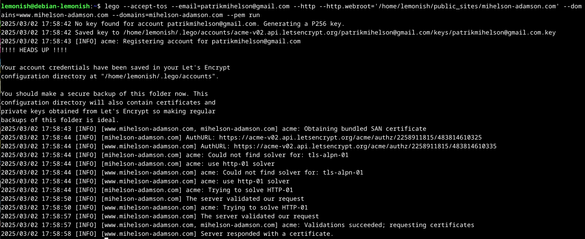

- b)

  > Tehtävänanto:
  > **A-rating. Testaa oma sivusi TLS jollain yleisellä laadunvarmistustyökalulla, esim. SSLLabs (Käytä vain tavanomaisia tarkistustyökaluja, ei tunkeutumistestausta eikä siihen liittyviä työkaluja)**

  Mentiin SSLLabsin sivulle[^1] ja täytettiin oma domainisivu. Alla olevassa kuvassa näkyy tulos.
  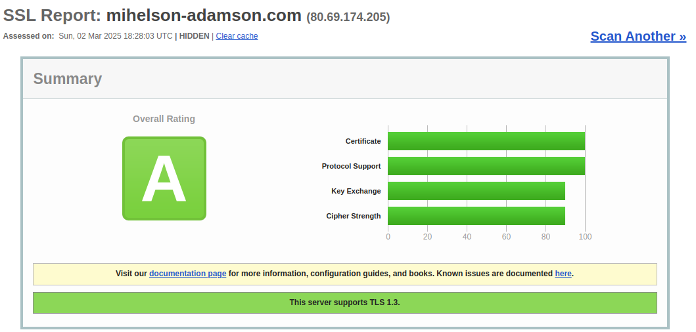

## Ympäristötiedot

#### CPU Information:

- Architecture: x86_64
- Model: 12th Gen Intel(R) Core(TM) i5-12600K
- Cores/Threads: 10 cores, 16 threads
- Virtualization: VT-x enabled
- Max Frequency: 4.9 GHz

#### Memory Info:

- Total: 31GB
- Used: 4.2GB
- Available: 26GB
- Swap: 8GB

#### Disk Info:

- Samsung 980 PRO SSD 1TB M.2 - SSD

#### Operating System Info:

- Ubuntu 24.04.1 LTS (Codename: noble)
- Kernel: 6.8.0-51-generic

#### VirtualBox Version:

- 7.0.16_Ubuntur162802

#### GPU Information:

```
+-----------------------------------------------------------------------------------------+
| NVIDIA-SMI 550.120                Driver Version: 550.120        CUDA Version: 12.4     |
|-----------------------------------------+------------------------+----------------------+
| GPU  Name                 Persistence-M | Bus-Id          Disp.A | Volatile Uncorr. ECC |
| Fan  Temp   Perf          Pwr:Usage/Cap |           Memory-Usage | GPU-Util  Compute M. |
|                                         |                        |               MIG M. |
|=========================================+========================+======================|
|   0  NVIDIA GeForce RTX 3080        Off |   00000000:01:00.0  On |                  N/A |
|  0%   37C    P5             34W /  340W |     623MiB /  10240MiB |      2%      Default |
|                                         |                        |                  N/A |
+-----------------------------------------+------------------------+----------------------+
```

## Lähteet

[^1]: [SSLLabs](https://www.ssllabs.com/ssltest/)
[^2]: [Let\'s Encrypt](https://letsencrypt.org/how-it-works/)
[^3]: [Lego](https://go-acme.github.io/lego/usage/cli/obtain-a-certificate/index.html)
[^4]: [Apache](https://httpd.apache.org/docs/2.4/ssl/ssl_howto.html#configexample)
[^5]: [TeroKarvinen](https://terokarvinen.com/linux-palvelimet/#h6-salataampa)
