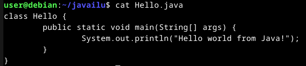
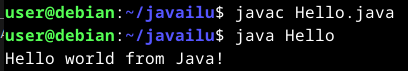
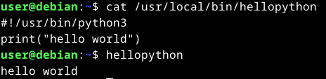
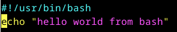
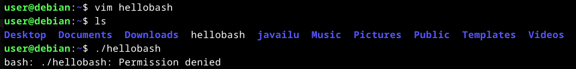
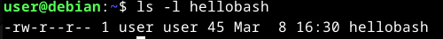
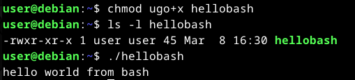
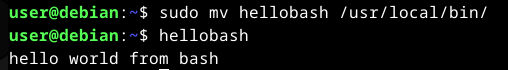

# H7

Tehtävänannot kaikki löytyneet [Tero Karvisen Linux Palvelimet -kurssin kotisivulta](https://terokarvinen.com/linux-palvelimet/)

- a)

  > Tehtävänanto:
  > **Kirjoita ja aja "Hei maailma" kolmella kielellä.**

  Tämä tehtävä olettaa, että olet asentanut Javan ja Python3:n, jotta se toimisi. Jos ei ole asennettu, niin seuraavan komennon pitäisi asennuttaa ne:

  ```
  sudo apt update && sudo apt install python3 openjdk-17-jdk
  ```

  Tehty `Hello.java` niminen tiedosto ja sinne sisään alla näkyvä teksti:

  

  Java-tiedostot täytyy compileta, se onnistuu komennolla `javac Hello.java`, sen jälkeen juuri compiletun ohjelman voi ajaa komennolla `java Hello`, kuten alla näkyy:

  

  Tämän Python-komennon tein tunnin aikana, mutta siihen riittää, että kirjoittaa alla näkyvän `cat`-komennon tulosteen tiedostoon ja sen jälkeen ajaa sen oikeilla oikeuksilla (ks. c-kohta). Pythonilla riittäisi myös tehdä tiedosto nimeltä `hello.py` johon kirjoittaa `print("Hello world")` ja sitten ajaa se terminaalista komennolla `python3 hello.py`

  

  Tässä tulee samalla nyt myös seuraava tehtävänanto, koska olin tunnilla tehnyt Python ja Java koodit hello worldille, mutta bash puuttui vielä, joten saan siinä kätevästi näytettyä kuinka komento tehdään ja saadaan suoritettavaksi kaikille käyttäjille.

- c)

  > Tehtävänanto:
  > **Laita Linuxiin uusi, itse tekemäsi komento niin, että kaikki käyttäjät voivat ajaa sitä.**

  Tehty tiedosto `hellobash` ja sinne kirjoitettu seuraava teksti komennolla `vim hellobash`

  

  `hellobash`-tiedosto luotu kotihakemistoon, sen jälkeen kokeiltu ajaa sitä, mutta tulee permission denied, eli tarvitaanvielä oikeuksia, mutta mitä oikeuksia?

  

  Tarkistetaan `hellobash` oikeudet seuraavalla komennolla `ls -l hellobash` ja huomataan, että se tarvitsee execute eli x -oikeudet.

  

  `chmod ugo+x hellobash` antaa kaikille käyttäjille execute -oikeudet hellobashille. Ajetaan `./hellobash` uudelleen

  

  Jotta ei tarvitsisi kirjoittaa `./` aina hellobashia ajaessa, voidaan siirtää se `/usr/local/bin`-hakemistoon, josta sen jälkeen komentoa voivat ajaa kaikki, eikä tarvitse olla `user`-nimisen käyttäjän kotihakemistossa sitä varten!

  

- d)

  > Tehtävänanto:
  > **Ratkaise vanha arvioitava laboratorioharjoitus soveltuvin osin.**

  Lähdin tekemään [tästä linkistä aukeavaa](https://terokarvinen.com/2019/arvioitava-laboratorioharjoitus-linux-palvelimet-ict4tn021-3004-ti-alkukevat-2019-5-op) laboratorioharjoitusta. Huomasin, että voisi olla hyvä harjoitella uuden käyttäjän luontia, käyttäjälle kotisivun tekemistä, etäkäyttöä ssh:lla ja nimipohjaista virtuaalipalvelua.

  Innokkaana tekijänä unohdin kokonaan, että olin tekemässä tehtävää varten tätä, joten kuvat unohtuivat. Komennot kuitenkin voin luetella selostuksineen hyvin `history` komennon avulla.

  Luotiin uusi käyttäjä koneelle

  ```
  sudo adduser testiuseri
  ```

  Kirjoitettiin tehtävänannon mukaisesti käyttäjänimi ja sen salasana tiedostoon `password.txt` ja rajattiin sen käyttöoikeuksia. Seuraavat komennot siirtävät `password.txt`:n `root`-käyttäjän omistamaksi ja sen jälkeen poistaa read, write ja execute oikeudet kaikilta muilta.

  ```
  chown root:root password.txt
  chmod ugo-rwx password.txt
  ```

  Käyttäjälle `testiuseri` voidaan tarvittaessa shellissä kirjautua sisään komennolla

  ```
  sudo -i -u testiuseri
  ```

  Tehdään kuitenkin pääkäyttäjällä seuraavat konffaukset. Jotta apache2 antaisi kotisivut käyttäjännimen perusteella, voidaan käyttää apachen `userdir` modia.

  ```
  sudo a2enmod userdir
  ```

  jonka jälkeen joudutaan hieman muuttamaan `userdir`:in konfiguraatiotiedostoa. Se näyttää aluksi seuraavanlaiselta

  ```bash
  user@debian:~$ sudo vim /etc/apache2/mods-enabled/userdir.conf

  # userdir.conf
  UserDir public_html
  UserDir disabled root

  <Directory /home/*/public_html>
      AllowOverride FileInfo AuthConfig Limit Indexes
      Options MultiViews Indexes SymLinksIfOwnerMatch IncludesNoExec
      Require method GET POST OPTIONS
  </Directory>
  ```

  Lisätään tähän tiedostoon käyttäjät, joille halutaan kotisivut näkymään. Eli lisätään seuraavanlainen rivi konfiguraatiotiedostoon UserDirien alapuolelle

  ```bash
  UserDir enabled testiuseri #(ja myös muita käyttäjiä tarpeen mukaan)
  ```

  Tämän jälkeen asetetaan kaikille käyttäjille oma `index.html` heidän kotihakemistonsa `public_html`-hakemistoon

  ```bash
  mkdir /home/testiuseri/public_html
  echo "hello t. testiuseri" >> /home/testiuseri/public_html/index.html
  ```

  Varmistetaan, että apachella on käyttöoikeudet nähdä `index.html`:n sisältö, samalla varmistaen, että mihinkään muuhun tiedostoon muut eivät pääse käsiksi:

  ```
  chmod go-rwx /home/testiuseri/*
  chmod ugo+rx /home/testiuseri
  chmod ugo+rx /home/testiuseri/public_html
  ```

  Potkaistaan demonia

  ```
  sudo systemctl restart apache2
  ```

  Testataan:

  ```
  user@debian:~$ curl localhost/~testiuseri/
  hello! t.testiuseri
  ```

  Seuraavaksi asetetaan ssh käytettäväksi. Käyttäjän tietokoneelle täytyy pystyttää ssh-palvelin:

  ```
  sudo apt update
  sudo apt install openssh-server
  ```

  asennuksen jälkeen käynnistetään ssh-palvelin ja laitetaan se käynnistymään aina kun kone käynnistetään uudelleen

  ```
  sudo systemctl start ssh
  sudo systemctl enable ssh
  ```

  Testataan komennolla `ssh testiuseri@localhost`, joka toimii jos kaikki on mennyt hyvin. Palataan kuitenkin vielä pääkäyttäjälle.

  Tehdään ssh-yhteydenteko vielä turvalliseksi julkisella avaimella. Avataan `ssh-keygen` -komennolla interaktiivinen avaimenluonti. Oletusarvoisesti, jos muita avaimia ei ole, niin komento luo `id-rsa.pub` nimisen tiedoston käyttäjän kotihakemiston `.ssh/`-hakemistoon.

  Kopioidaan juuri luotu `id-rsa.pub`-tiedosto käyttäjälle, jonne halutaan ssh:ttaa.

  ```
  ssh-copy-id -i /home/user/.ssh/id_rsa.pub testiuseri@localhost
  ```

  jonka jälkeen käydään `sshd_config`-tiedostossa poistamassa mahdollisuus kirjautua salasanalla, ja lisäämässä mahdollisuus kirjautua julkisella avaimella.

  ```
  sudo vim /etc/ssh/sshd_config

  # /etc/ssh/sshd_config
  ...
  PubkeyAuthentication yes
  PasswordAuthentication no
  ...
  ```

  testataan, että toimii. Pitäisi toimia jos kaikki mennyt ok.

  ```
  ssh testiuseri@localhost
  ```

  EvilNinja -madon voi huomata annettujen tietojen perusteella käyttämällä `journalctl`-komentoa.

  ```
  sudo journalctl | grep -i "evilninja"
  ```

  Nimipohjainen virtuaalipalvelu laitetaan päälle seuraavasti:

  Asetetaan feikkiurli osoittamaan localhostin sijaan 127.0.0.1:lle

  ```
  sudo vim /etc/hosts

  # /etc/hosts
  ...
  #127.0.0.1 localhost
  127.0.0.1 testiuseri.com
  ...
  ```

  Siirretään testikäyttäjän `index.html` uuteen hakemistoon ja sinne uutta sisältöä.

  ```bash
  mv -P /home/testiuseri/public_html/index.html /home/testiuseri/public_html/testiuseri.com/index.html
  vim /home/testiuseri/public_html/testiuseri.com/index.html

  # index.html
  hello testiuseri.com! t.testiuseri
  ```

  Sitten asetetaan apache2 näyttämään tämä sisältö, kun haetaan nimipalvelinta `testiuseri.com`.

  ```bash
  sudo vim /etc/apache2/sites-available/testiuseri.com.conf

  # testiuseri.com.conf
  <VirtualHost *:80>
      ServerName testiuseri.com
      DocumentRoot /home/testiuseri/public_html/testiuseri.com
      <Directory /home/testiuseri/public_html/testiuseri.com>
          Require all granted
      </Directory>
  </VirtualHost>
  ```

  Tämän jälkeen laitetaan site voimaan ja potkaistaan demonia

  ```
  sudo a2ensite /etc/apache2/sites-available/testiuseri.com.conf
  sudo systemctl restart apache2
  ```

  Testataan:

  ```
  user@debian:/etc/apache2/sites-available$ curl testiuseri.com
  hello testiuseri.com! t.testiuseri
  ```

  Tähän saa nyt riittää omasta mielestäni labraharjoitukset. Käyty läpi melkein kaikki mitä kurssilla on käyty terminaalissa. Ohjeena näihin käytin suurimmilta osin omia vanhoja muistiinpanoja edellisiltä viikoilta.

## Ympäristötiedot

#### CPU Information:

- Architecture: x86_64
- Model: 12th Gen Intel(R) Core(TM) i5-12600K
- Cores/Threads: 10 cores, 16 threads
- Virtualization: VT-x enabled
- Max Frequency: 4.9 GHz

#### Memory Info:

- Total: 31GB
- Used: 4.2GB
- Available: 26GB
- Swap: 8GB

#### Disk Info:

- Samsung 980 PRO SSD 1TB M.2 - SSD

#### Operating System Info:

- Ubuntu 24.04.1 LTS (Codename: noble)
- Kernel: 6.8.0-51-generic

#### VirtualBox Version:

- 7.0.16_Ubuntur162802

#### GPU Information:

```
+-----------------------------------------------------------------------------------------+
| NVIDIA-SMI 550.120                Driver Version: 550.120        CUDA Version: 12.4     |
|-----------------------------------------+------------------------+----------------------+
| GPU  Name                 Persistence-M | Bus-Id          Disp.A | Volatile Uncorr. ECC |
| Fan  Temp   Perf          Pwr:Usage/Cap |           Memory-Usage | GPU-Util  Compute M. |
|                                         |                        |               MIG M. |
|=========================================+========================+======================|
|   0  NVIDIA GeForce RTX 3080        Off |   00000000:01:00.0  On |                  N/A |
|  0%   37C    P5             34W /  340W |     623MiB /  10240MiB |      2%      Default |
|                                         |                        |                  N/A |
+-----------------------------------------+------------------------+----------------------+
```
